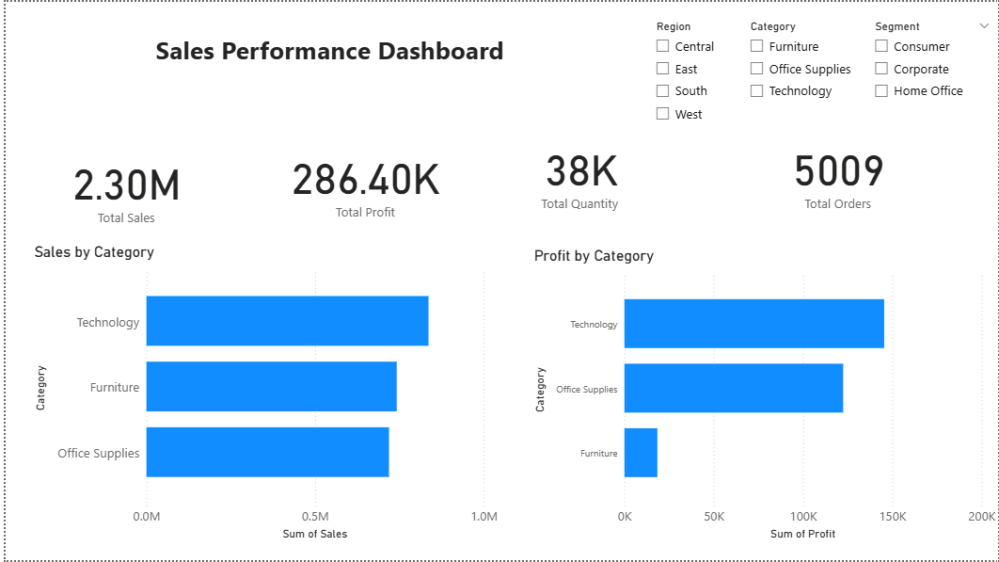
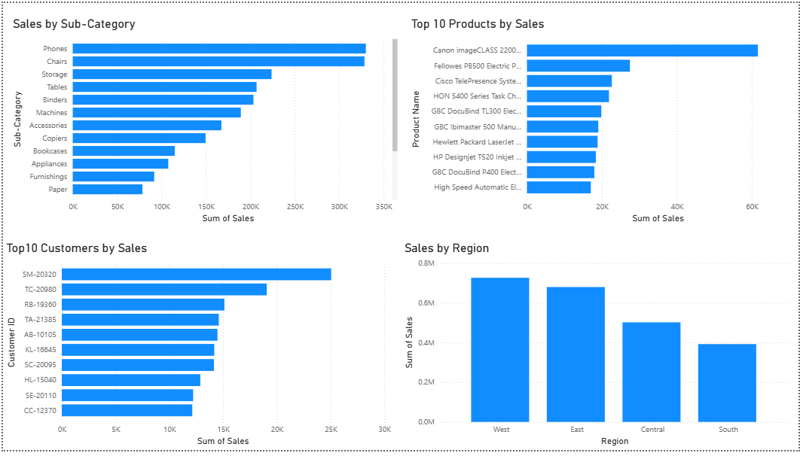
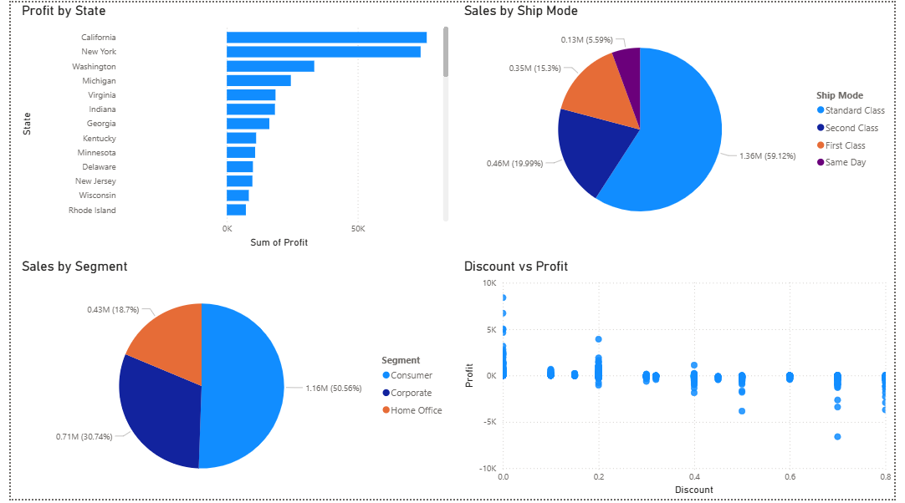

# 📊 Sales Performance Dashboard

## 📌 Project Overview

The **Sales Performance Dashboard** is a Data Analytics project built using **Microsoft Excel, MySQL, and Power BI**. The project focuses on preparing sales data, analyzing business performance using SQL, and creating an interactive dashboard to visualize key sales insights.

The dashboard helps businesses understand sales performance across different product categories, states, shipping modes, and discount levels.

---

# 🛠 Tools & Technologies Used

- Microsoft Excel
- MySQL
- Power BI
- GitHub

---

# 📂 Project Workflow

## 📑 Step 1: Data Preparation (Microsoft Excel)

The Sample Superstore dataset was prepared in Microsoft Excel before importing it into MySQL.

### Tasks Performed

- Imported the dataset
- Checked data quality
- Removed duplicate records
- Saved the cleaned dataset as CSV for SQL analysis

---

## 🗄 Step 2: Data Analysis (MySQL)

The cleaned dataset was imported into MySQL to perform business analysis.

### SQL Analysis Included

- Total Sales
- Total Profit
- Total Quantity Sold
- Sales by Category
- Profit by Category
- Sales by State
- Sales by Ship Mode
- Discount vs Profit Analysis

SQL concepts used:

- SELECT
- COUNT()
- SUM()
- AVG()
- ROUND()
- GROUP BY
- ORDER BY

---

## 📊 Step 3: Dashboard Development (Power BI)

Created an interactive Sales Performance Dashboard using Power BI.

### KPI Cards

- Total Sales
- Total Profit
- Total Quantity Sold

### Dashboard Visualizations

- Sales by Category
- Profit by Category
- Sales by State
- Sales by Ship Mode
- Discount vs Profit Scatter Plot

### Interactive Features

- Slicers
- Filters
- Interactive Dashboard

---

# 📈 Key Insights

- Technology generated one of the highest profits.
- Office Supplies produced high sales but comparatively lower profit.
- Higher discounts generally reduced profitability.
- Sales performance varied across different states.
- Standard Class was the most frequently used shipping mode.

---

# 📁 Project Files

- 📄 Sample_Superstore.csv
- 📄 salesanalysis.sql
- 📄 superstoredashboard.pbix
- 📄 superstoredashboard.pdf
- 🖼 sales_dashboard_ss1.png
- 🖼 sales_dashboard_ss2.png
- 🖼 sales_dashboard_ss3.png

---

# 📷 Dashboard Preview

## Dashboard Overview

## Sales Analysis

## Interactive Dashboard

---

# 🚀 Skills Demonstrated

### Microsoft Excel

- Data Cleaning
- Removing Duplicates
- Data Preparation

### MySQL

- Data Import
- SQL Queries
- Aggregate Functions
- GROUP BY
- ORDER BY
- Business Data Analysis

### Power BI

- KPI Cards
- Charts
- Slicers
- Interactive Dashboard
- Data Visualization
- Dashboard Formatting

---

# 🎯 Project Outcome

This project demonstrates a complete workflow starting from data preparation in Microsoft Excel, performing business analysis using MySQL, and creating an interactive Power BI dashboard to present sales insights.

The dashboard enables users to monitor sales performance, compare product categories, evaluate shipping modes, analyze discount impact, and make data-driven business decisions.

---

## 👩‍💻 Author

**Ada Donatella**

Aspiring Data Analyst skilled in Microsoft Excel, MySQL, Power BI, Python, and Data Visualization.

GitHub: https://github.com/adadntla
